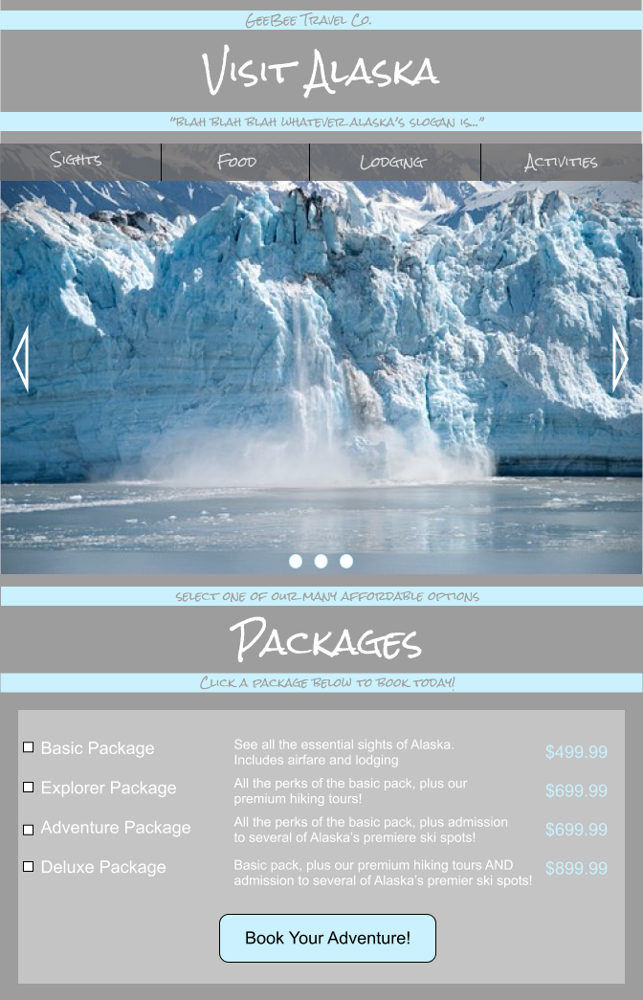

This is a project for my front-end development course at **The Iron Yard**-_Minneapolis_.  
The assignment is to design a travel website and create it using bootstrap.  
My chosen destination was alaska. I created my initial design on Figma. You can see it below.  

